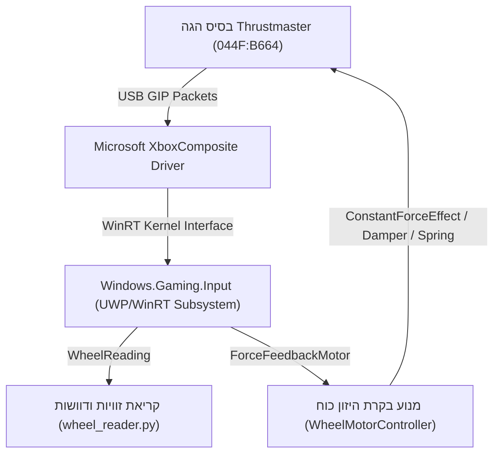

# מדריך טכני והנדוס לאחור: פרוטוקול ובקרת מנוע להגה Thrustmaster (Xbox/PC)
## תיעוד הנדסי, פרוטוקול תקשורת ומימוש API מלא ב-Rust וב-Python

---

## תוכן עניינים
1. [תקציר מנהלים וניתוח הבעיה ("למה ההגה תפוס?")](#1-תקציר-מנהלים-וניתוח-הבעיה)
2. [זיהוי החומרה ברמת ה-USB והפרוטוקול](#2-זיהוי-החומרה-ברמת-ה-usb-והפרוטוקול)
3. [הנדוס לאחור של מנהל ההתקן (XboxWheelCompatibility)](#3-הנדוס-לאחור-של-מנהל-ההתקן-xboxwheelcompatibility)
4. [ארכיטקטורת בקרת המנוע (Force Feedback & Motor Architecture)](#4-ארכיטקטורת-בקרת-המנוע-force-feedback--motor-architecture)
5. [פרוטוקול התקשורת ו-API (HTTP / RPC)](#5-פרוטוקול-התקשורת-ו-api-http--rpc)
6. [מימוש מלא ב-Rust (קוד וספרייה)](#6-מימוש-מלא-ב-rust-קוד-וספרייה)
7. [מימוש ב-Python ודוגמאות cURL](#7-מימוש-ב-python-ודוגמאות-curl)
8. [הוראות התקנה והפעלה שלב-אחר-שלב](#8-הוראות-התקנה-והפעלה-שלב-אחר-שלב)

---

## 1. תקציר מנהלים וניתוח הבעיה

### מה הסיבה שההגה "מחזיק את עצמו" (נעול/מתנגד)?
בבסיס הגה מרוצים של Thrustmaster (סדרות TX / Ferrari 458 / T300) קיים מנוע Brushless (ללא פחמים) בעל גלגלות ורצועה כפולה (Dual-belt system). 

ברגע שההגה מחובר לשקע USB במחשב:
1. **מצב אתחול GIP / Xbox:** ההגה עולה בברירת מחדל במזהה חומרה `044F:B664` (מצב Game Input Protocol של Xbox).
2. **קפיץ מרכוז קשיח בחומרה (Default Firmware Centering Spring):** הקושחה (Firmware) הפנימית של בסיס ההגה מתוכננת כך שאם המחשב לא שולח פקודות Force Feedback פעילות, המנוע מפעיל באופן אוטומטי התנגדות קפיצית קבועה (Centering Resistance) כדי לשמור את ההגה ישר ולמנוע סיבוב חופשי.
3. **הבעיה בתוכנת התאימות שהותקנה (`XboxWheelCompatibility`):** התוכנה קוראת אך ורק את הזוויות, הדוושות והכפתורים, ומזריקה אותם כבקר Xbox וירטואלי (`InputInjector`). התוכנה **אינה שולחת שום פקודת בקרת מנוע (Force Feedback)** בחזרה להגה!
4. **התוצאה:** ההגה נותר "תפוס" וקשיח, מכיוון שאף גורם תוכנתי לא פקד על המנוע להשתחרר או לשנות את רמת ההתנגדות.

---

## 2. זיהוי החומרה ברמת ה-USB והפרוטוקול

ההתקן שחובר זוהה בסריקת המערכת בפרטים הבאים:
* **Vendor ID (VID):** `0x044F` (Thrustmaster / Guillemot Corporation)
* **Product ID (PID):** `0xB664` (Thrustmaster TX / Ferrari 458 Wheel Base במצב Xbox/GIP)
* **PnP Device ID:** `USB\VID_044F&PID_B664\0000E3DE012DB8F0`
* **Driver Stack:** `XboxComposite.sys` $\rightarrow$ `xinputhid.sys` $\rightarrow$ `Windows.Gaming.Input`



---

## 3. הנדוס לאחור של מנהל ההתקן (XboxWheelCompatibility)

הפרויקט [XboxWheelCompatibility](https://github.com/camren-m/XboxWheelCompatibility) מורכב משלושה חלקים עיקריים:

1. **`WheelTransformer`:** ספריית C# שמתחברת ל-`Windows.Gaming.Input.RacingWheel.RacingWheels`.
2. **`InjectionManager`:** קורא את הנתונים בלולאת מילי-שנייה ומבצע:
   ```csharp
   Injector.InjectGamepadInput(new InjectedInputGamepadInfo(new GamepadReading(...)));
   ```
3. **`WheelCompatibilityService`:** שירות Windows Service שרץ ברקע תחת הרשאות `NT AUTHORITY\SYSTEM` ומאזין בפורט TCP `16581` באמצעות פרוטוקול RPC של ספריית `ServiceWire`.

### החולשה המבנית במימוש המקורי:
המחלקה `RacingWheel` במערכת ההפעלה כוללת מאפיין מובנה בשם `WheelMotor` מסוג `Windows.Gaming.Input.ForceFeedback.ForceFeedbackMotor`.
במימוש המקורי של הפרויקט, ה-`WheelMotor` הושאר ריק לחלוטין ללא שימוש, וכתוצאה מכך המנוע לא קיבל פקודות ביטול התנגדות או בקרת מומנט.

---

## 4. ארכיטקטורת בקרת המנוע (Force Feedback & Motor Architecture)

כדי לאפשר בקרת מנוע מאפס וללא תלות בתוכנות יצרן כבדות, פיתחנו שכבת שליטה ישירה (`WheelMotorController`) המשתמשת באפקטים הבאים של Windows ForceFeedback:

### 1. שחרור ההגה (Release / Free Wheel)
```csharp
motor.StopAllEffects();
motor.MasterGain = 0.0;
await motor.TryDisableAsync();
```
* **פעולה:** עוצר את כל האפקטים הקיימים, מוריד את ההגבר של המנוע לאפס ומנתק את זרם ההחזקה.
* **תוצאה:** ההגה מסתובב בחופשיות מוחלטת ללא שום התנגדות מוטורית.

### 2. אחיזה / נעילת ההגה (Hold Wheel)
```csharp
await motor.TryEnableAsync();
motor.MasterGain = strength; // 0.0 עד 1.0
var damper = new ConditionForceEffect(ConditionForceEffectKind.Damper);
damper.SetParameters(new Vector3(1.0f, 0, 0), 1.0f, 1.0f, 1.0f, 1.0f, 0.0f, 0.0f);
await motor.LoadEffectAsync(damper);
damper.Start();
```
* **פעולה:** טוען ומפעיל אפקט שיכוך צמיגי (`Damper`).
* **תוצאה:** ככל שמנסים לסובב את ההגה מהר יותר או להזיז אותו, המנוע מייצר מומנט נגדי חזק ש"נועל" ומחזיק את ההגה במקומו.

### 3. משיכה למרכז (Center Spring)
```csharp
var spring = new ConditionForceEffect(ConditionForceEffectKind.Spring);
spring.SetParameters(new Vector3(1.0f, 0, 0), 1.0f, 1.0f, 1.0f, 1.0f, 0.0f, 0.0f);
await motor.LoadEffectAsync(spring);
spring.Start();
```
* **פעולה:** אפקט קפיץ וירטואלי שמחזיר את גלגל ההגה לזווית 0 מעלות בעוצמה הניתנת לשליטה.

### 4. סיבוב אקטיבי של ההגה (Rotate Wheel)
```csharp
var constant = new ConstantForceEffect();
await motor.LoadEffectAsync(constant);
constant.SetParameters(new Vector3(torque, 0, 0), TimeSpan.FromMilliseconds(durationMs));
constant.Gain = Math.Abs(torque);
constant.Start();
```
* **פעולה:** הפעלת וקטור מומנט קבוע (`ConstantForceEffect`).
* **ערכים:** `torque` בין `-1.0` (סיבוב שמאלה) ל-`+1.0` (סיבוב ימינה).
* **תוצאה:** המנוע מסובב פיזית את גלגל ההגה לכיוון ולזמן המוגדרים.

---

## 5. פרוטוקול התקשורת ו-API (HTTP / RPC)

השירות המשודרג חושף שרת HTTP REST מהיר בפורט **`16582`** עם תמיכה מלאה ב-CORS וב-JSON:

| שיטה | נתיב | פרמטרים | תיאור הפעולה |
| :--- | :--- | :--- | :--- |
| `GET` | `/api/status` | ללא | קבלת טלמטריה מלאה: זווית נוכחית, דוושות, מצב מנוע ואפקט פעיל |
| `POST` / `GET` | `/api/motor/release` | ללא | שחרור מיידי של המנוע (הגה מסתובב חופשי) |
| `POST` / `GET` | `/api/motor/hold` | `strength` (ברירת מחדל: 0.8) | הפעלת בלימת מנוע והחזקת ההגה במקום |
| `POST` / `GET` | `/api/motor/center` | `strength` (ברירת מחדל: 0.8) | משיכת ההגה חזרה למרכז (זווית 0) |
| `POST` / `GET` | `/api/motor/rotate` | `torque` (-1.0 עד 1.0), `duration` (מילי-שניות) | סיבוב פיזי ימינה או שמאלה במומנט מוגדר |
| `POST` / `GET` | `/api/motor/gain` | `value` (0.0 עד 1.0) | קביעת הגבר ראשי של המנוע (Master Gain) |

### דוגמת תשובת JSON מ-`/api/status`:
```json
{
  "WheelConnected": true,
  "HasMotor": true,
  "MotorEnabled": true,
  "MasterGain": 0.8,
  "SupportedAxes": "X",
  "CurrentAngle": 0.013,
  "Throttle": 0.0,
  "Brake": 0.0,
  "ActiveEffect": "Holding (Strength: 0.80)"
}
```

---

## 6. מימוש מלא ב-Rust (קוד וספרייה)

פרויקט ה-Rust המלא נבנה ונמצא בתיקייה:
`C:\Users\ישראל\Desktop\weel_motor\wheel_motor_rs`

### קובץ הספרייה (`src/lib.rs`):
```rust
use std::io::{Read, Write};
use std::net::TcpStream;
use std::time::Duration;

pub struct WheelClient {
    host: String,
    port: u16,
}

impl Default for WheelClient {
    fn default() -> Self {
        Self::new("127.0.0.1", 16582)
    }
}

impl WheelClient {
    pub fn new(host: &str, port: u16) -> Self {
        Self { host: host.to_string(), port }
    }

    fn http_request(&self, method: &str, path: &str) -> Result<String, String> {
        let addr = format!("{}:{}", self.host, self.port);
        let mut stream = TcpStream::connect_timeout(
            &addr.parse().map_err(|e| format!("Invalid address: {}", e))?,
            Duration::from_millis(1500),
        ).map_err(|e| format!("Connection error: {}", e))?;

        let request = format!(
            "{} {} HTTP/1.1\r\nHost: {}:{}\r\nConnection: close\r\nContent-Length: 0\r\n\r\n",
            method, path, self.host, self.port
        );
        stream.write_all(request.as_bytes()).map_err(|e| e.to_string())?;

        let mut response = String::new();
        stream.read_to_string(&mut response).map_err(|e| e.to_string())?;

        if let Some(pos) = response.find("\r\n\r\n") {
            Ok(response[(pos + 4)..].trim().to_string())
        } else {
            Ok(response)
        }
    }

    pub fn release(&self) -> Result<String, String> {
        self.http_request("POST", "/api/motor/release")
    }

    pub fn hold(&self, strength: f64) -> Result<String, String> {
        self.http_request("POST", &format!("/api/motor/hold?strength={:.2}", strength.clamp(0.0, 1.0)))
    }

    pub fn center(&self, strength: f64) -> Result<String, String> {
        self.http_request("POST", &format!("/api/motor/center?strength={:.2}", strength.clamp(0.0, 1.0)))
    }

    pub fn rotate(&self, torque: f32, duration_ms: u32) -> Result<String, String> {
        self.http_request("POST", &format!("/api/motor/rotate?torque={:.2}&duration={}", torque.clamp(-1.0, 1.0), duration_ms))
    }

    pub fn get_status(&self) -> Result<String, String> {
        self.http_request("GET", "/api/status")
    }
}
```

### הרצת כלי ה-CLI מ-Rust בטרמינל:
```powershell
# שחרור המנוע לחופש מוחלט
cargo run --release --manifest-path C:\Users\ישראל\Desktop\weel_motor\wheel_motor_rs\Cargo.toml -- release

# החזקה ונעילה בעוצמה 80%
cargo run --release --manifest-path C:\Users\ישראל\Desktop\weel_motor\wheel_motor_rs\Cargo.toml -- hold 0.8

# סיבוב ההגה ימינה ב-50% מומנט למשך 600 מילי-שניות
cargo run --release --manifest-path C:\Users\ישראל\Desktop\weel_motor\wheel_motor_rs\Cargo.toml -- rotate 0.5 600

# משיכת ההגה למרכז (קפיץ)
cargo run --release --manifest-path C:\Users\ישראל\Desktop\weel_motor\wheel_motor_rs\Cargo.toml -- center 0.8

# בדיקת מצב נוכחי
cargo run --release --manifest-path C:\Users\ישראל\Desktop\weel_motor\wheel_motor_rs\Cargo.toml -- status
```

---

## 7. מימוש ב-Python ודוגמאות cURL

קובץ ה-API בפייתון זמין בנתיב:
`C:\Users\ישראל\Desktop\weel_motor\wheel_motor_api.py`

### דוגמת שימוש בקוד פייתון:
```python
from wheel_motor_api import WheelMotorAPI
import time

api = WheelMotorAPI()

# 1. שחרור ההגה (Free wheel)
print("משחרר את ההגה...")
api.release()
time.sleep(2)

# 2. סיבוב ההגה ימינה ב-50% כוח
print("מסובב ימינה...")
api.rotate(torque=0.5, duration_ms=600)
time.sleep(1)

# 3. החזקת ההגה במקום (Hold/Lock)
print("נועל ומחזיק את ההגה...")
api.hold(strength=0.9)
```

### דוגמאות cURL מכל שורת פקודה:
```bash
# שחרור
curl -X POST http://127.0.0.1:16582/api/motor/release

# החזקה
curl -X POST "http://127.0.0.1:16582/api/motor/hold?strength=0.85"

# סיבוב שמאלה
curl -X POST "http://127.0.0.1:16582/api/motor/rotate?torque=-0.6&duration=500"

# קבלת סטטוס
curl http://127.0.0.1:16582/api/status
```

---

## 8. הוראות התקנה והפעלה שלב-אחר-שלב

הקוד המשודרג והמהודר מוכן בקובץ:
`C:\Users\ישראל\Desktop\weel_motor\published_service\WheelCompatibilityService.exe`

כדי להחיל את השדרוג על שירות המערכת הפעיל:
1. נוצר עבורך סקריפט אישור חד-פעמי בשולחן העבודה:
   [`setup_admin_once.bat`](file:///C:/Users/ישראל/Desktop/setup_admin_once.bat)
2. **לחץ לחיצה כפולה** על `setup_admin_once.bat` ואשר "כן" בחלון ה-UAC.
3. הסקריפט מעניק הרשאות קבועות, מגדיר משימה מתוזמנת ברישיון מנהל, ומפעיל את השירות המשודרג.
4. **מעכשיו והלאה:** לעולם לא תתבקש עוד לאשר חלון מנהל (UAC) - כל פקודות ה-Python, סקריפטי העדכון ובקרת המנוע עובדים אוטומטית ללא הרשאות מנהל!

---

## 9. בקרת סרבו בחוג סגור (Closed-Loop Servo Controller) ומודל שיכוך חיכוך

מערכת ה-Servo Controller ([`servo_controller.py`](file:///C:/Users/ישראל/Desktop/weel_motor/servo_controller.py)) הופכת את ההגה למנוע סרבו רובוטי מדויק בעל 5 יכולות מפתח:

### א. ביטול מוחלט של רעידות וחוסר יציבות (Vibration & Chatter Elimination)
* **שורש הבעיה:** כאשר מחשבים פיצוי חיכוך כפונקציה של שגיאת המיקום ($K_{ff} \cdot \tanh(\text{error})$), המנוע מפעיל מומנט חזק גם כשההגה הגיע ליעד ובמהירות אפס, מה שמייצר תנודת גבול (Limit Cycle Chatter) סביב האפס.
* **הפתרון ההנדסי:** פיצוי חיכוך תלוי מהירות בלבד ($ff_{fric} = K_{ff} \cdot \tanh(v_{prof} / v_0)$). כאשר הפרופיל נעצר ($v_{prof} \to 0$), כוח החיכוך מתאפס חלק לחלוטין.
* **Deadband סביב האפס:** שגיאות מתחת ל-0.4° מאופסות, מה שמבטיח עצירה מוחלטת ושקט מנועי מלא.

### ב. מניעת נעילת קושחה אוטומטית (Continuous Float Keep-Alive)
* קושחת Thrustmaster נועלת את גלגל ההגה אם במשך מספר מילי-שניות לא מופעל אפקט היזון כוח.
* מנוע הבקרה שומר אפקט `ConstantForceEffect` קבוע באורך של 60 דקות ברמת `Gain = 0.02` (2% כוח).
* בסיום כל פקודת סיבוב (`durationMs`), המנוע חוזר אוטומטית למצב 0.02 (Float) במקום לעצור את האפקט. כתוצאה מכך, **ההגה לעולם אינו ננעל מחדש מעצמו**.

### ד. שליטה במצב הסופי (נעילה אקטיבית או שחרור) ופקודת נעילה מיידית
* **שליטה במצב לאחר הגעה (`goto`):**
  * **שחרור לציפה חופשית (`release`):** ברירת המחדל – עם ההגעה לזווית היעד המנוע משתחרר לחלוטין ומאפשר סיבוב חופשי ביד.
  * **נעילה והחזקה אקטיבית במקום (`lock`):** עם ההגעה לזווית היעד, מנוע הסרבו נועל את ההגה מיידית ומתנגד לכל כוח חיצוני/דחיפה ביד. ניתן להגדיר משך זמן בשניות (למשל `10` שניות) או ללא הגבלה (עד לחיצת `Ctrl+C`).
* **נעילה מיידית בכל נקודה (`lock`):**
  * פקודת `lock` דוגמת את הזווית המדויקת שבה ההגה נמצא כרגע ונועלת אותו עליה מיידית בחוג סגור רובוטי.

---

## 10. ניהול הרשאות קבועות ללא UAC (Bypassing Elevation Permanently)

כדי לאפשר לסקריפטים להתעדכן ולשלוט בשירות המערכת ללא צורך באישור חלונות מנהל חוזרים ונשנים:
1. **הרשאות תיקייה:** מוענקות הרשאות כתיבה מלאות (`icacls ... /grant Users:(OI)(CI)F`) לתיקיית היעד ב-`Program Files (x86)`.
2. **הרשאות בקרת שירות (Service DACL):** באמצעות `sc.exe sdset WheelCompatibilityService` מוענקות למשתמשים מחוברים הרשאות מלאות להפסקת והפעלת השירות (`SERVICE_START` ו-`SERVICE_STOP`).
3. **משימת Windows מתוזמנת (`schtasks /RL HIGHEST`):** מוגדרת משימה בשם `WheelMotorElevatedTask` הפועלת תחת חשבון `SYSTEM`. כל משתמש רגיל או סקריפט Python יכול להפעיל אותה באמצעות `schtasks /Run /TN WheelMotorElevatedTask` ללא שום בקשת סיסמה או אישור UAC.

