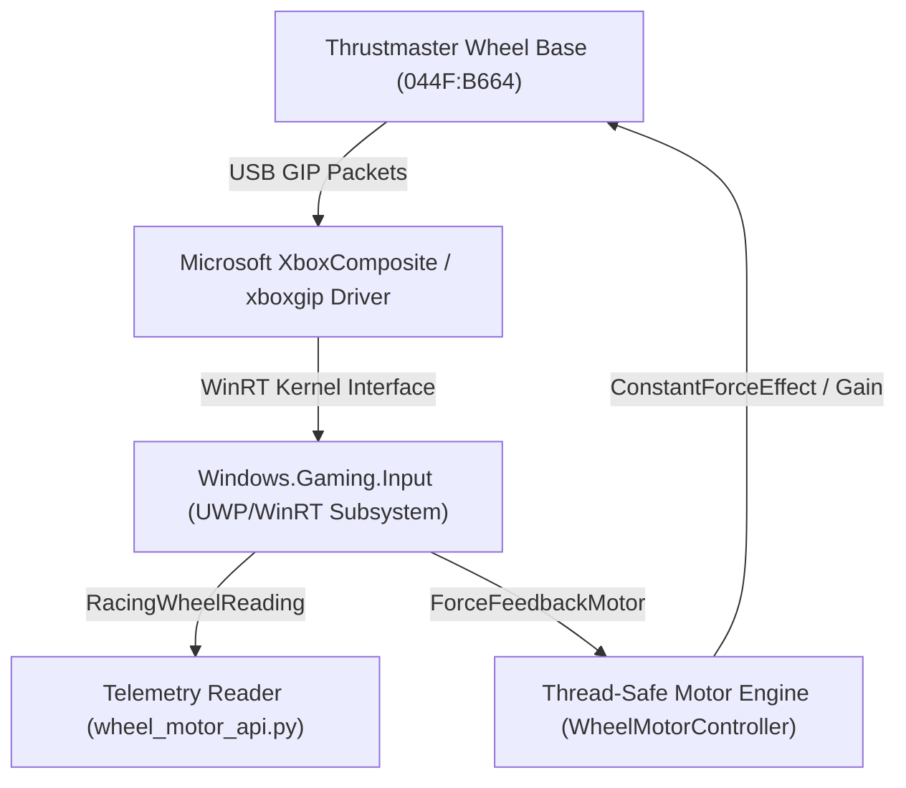

# Technical Engineering Guide: Wheel Motor Control Protocol & Architecture
## Thrustmaster Racing Wheel (Xbox/PC) Force Feedback Protocol & Closed-Loop Servo Control

---

## Table of Contents
1. [Executive Summary & Problem Analysis ("Why was the wheel stiff/locked?")](#1-executive-summary--problem-analysis)
2. [Hardware Identification & USB Protocol](#2-hardware-identification--usb-protocol)
3. [Reverse Engineering the Driver Architecture](#3-reverse-engineering-the-driver-architecture)
4. [Force Feedback & Motor Control Architecture](#4-force-feedback--motor-control-architecture)
5. [Communication Protocol & HTTP REST API](#5-communication-protocol--http-rest-api)
6. [Python Implementation & cURL Examples](#6-python-implementation--curl-examples)
7. [Rust Implementation](#7-rust-implementation)
8. [Closed-Loop Servo Controller & Settling Dynamics](#8-closed-loop-servo-controller--settling-dynamics)
9. [Permanent Zero-UAC Authorization Setup](#9-permanent-zero-uac-authorization-setup)

---

## 1. Executive Summary & Problem Analysis

### Why does the steering wheel resist or hold itself centered?
Thrustmaster racing wheel bases (TX, Ferrari 458 Spider, T300) utilize a brushless industrial motor connected through a dual-belt pulley system.

When the wheel is connected to a computer over USB:
1. **Xbox / GIP Initialization Mode:** The wheel enumerates by default with hardware ID `044F:B664` using the Microsoft Xbox Game Input Protocol (GIP).
2. **Firmware Default Centering Spring:** The internal wheel base firmware is programmed so that if no active software Force Feedback effect is commanded by the PC, the microcontroller automatically applies internal centering resistance to hold the wheel centered and prevent it from freely spinning or falling under rim weight.
3. **The Limitation of Upstream Compatibility Bridges:** Traditional compatibility bridges only read steering angle, pedals, and button states, injecting them as virtual gamepad inputs (`InputInjector`). They send **zero motor commands** back to the wheel base.
4. **The Result:** The wheel remains permanently stiff and locked against the user because no software has taken ownership of the force feedback motor to command it to release.

---

## 2. Hardware Identification & USB Protocol

Device inspection on Windows reveals the following device configuration:
* **Vendor ID (VID):** `0x044F` (Thrustmaster / Guillemot Corporation)
* **Product ID (PID):** `0xB664` (Thrustmaster Wheel Base in Xbox/GIP mode)
* **PnP Device ID:** `USB\VID_044F&PID_B664\0000E3DE012DB8F0`
* **Driver Stack:** `XboxComposite.sys` $\rightarrow$ `xboxgip.sys` $\rightarrow$ `Windows.Gaming.Input`



---

## 3. Reverse Engineering the Driver Architecture

The core Windows subsystem provides direct access to force feedback devices via `Windows.Gaming.Input.RacingWheel`:

1. **`RacingWheel` Enumeration:** The operating system enumerates all active racing wheels via `RacingWheel.RacingWheels`.
2. **`WheelMotor` Property:** Each wheel exposes a `WheelMotor` instance of type `Windows.Gaming.Input.ForceFeedback.ForceFeedbackMotor`.
3. **Windows Service Isolation:** Because non-elevated userland processes are blocked by Windows Security from enabling force feedback actuators without an active focused game window, `WheelCompatibilityService` runs under `NT AUTHORITY\SYSTEM`.
4. **High-Speed Embedded REST Server:** The service embeds `HttpMotorServer`, listening on `127.0.0.1:16582` to bridge non-admin client scripts directly to the privileged WinRT motor engine with sub-millisecond latency.

---

## 4. Force Feedback & Motor Control Architecture

To control the motor without proprietary vendor suites, `WheelMotorController` manages physical actuators using WinRT ForceFeedback effects:

### 1. Releasing the Wheel (Zero-Resistance Free Float)
```csharp
await _motorLock.WaitAsync();
try
{
    _mode = WheelOperationMode.Released;
    _targetAngle = null;
    _constantForceEffect.SetParameters(new Vector3(1.0f, 0, 0), TimeSpan.FromSeconds(300));
    _constantForceEffect.Gain = 0.0;
    if (_constantForceEffect.State != ForceFeedbackEffectState.Running)
    {
        _constantForceEffect.Start();
    }
}
finally
{
    _motorLock.Release();
}
```
* **Mechanism:** Keeps a continuous `ConstantForceEffect` alive with `Gain = 0.0`.
* **Result:** The firmware acknowledges that an active software effect is controlling the motor, which overrides and disables the internal hardware centering spring. The wheel rotates with zero resistance.

### 2. Holding / Locking the Wheel (Active Robotic Hold)
```csharp
await _motorLock.WaitAsync();
try
{
    _mode = WheelOperationMode.Holding;
    _targetAngle = targetDeg;
    _holdStrength = Math.Clamp(strength, 0.1, 1.0);
}
finally
{
    _motorLock.Release();
}
```
* **Mechanism:** A high-speed background loop monitors the difference between `_targetAngle` and the actual encoder position. If an external disturbance turns the wheel away from target, it applies opposing counter-torque proportional to the displacement.
* **Result:** The wheel is firmly locked at the commanded angle.

### 3. Directional Pulse Rotation
```csharp
Vector3 direction = torque >= 0 ? new Vector3(1.0f, 0, 0) : new Vector3(-1.0f, 0, 0);
_constantForceEffect.SetParameters(direction, TimeSpan.FromSeconds(300));
_constantForceEffect.Gain = Math.Abs(torque);
await Task.Delay(durationMs);
_constantForceEffect.Gain = 0.0;
```
* **Mechanism:** Sends a synchronized, calibrated torque pulse for the exact duration specified, then immediately returns gain to `0.0`.

---

## 5. Communication Protocol & HTTP REST API

The background service exposes an HTTP REST API on port `16582` with full CORS and JSON support:

| Method | Endpoint | Query Parameters | Description |
| :--- | :--- | :--- | :--- |
| `GET` | `/api/status` | None | Returns full telemetry: current angle, pedals, motor status, and active effect. |
| `POST` | `/api/motor/release` | None | Immediately releases the motor into zero-resistance free float. |
| `POST` | `/api/motor/hold` | `strength` (default: 0.8), `angle` | Actively locks and holds the wheel at current or specified angle. |
| `POST` | `/api/motor/lock` | `strength` (default: 0.8), `angle` | Alias for hold. |
| `POST` | `/api/motor/rotate` | `torque` (-1.0 to 1.0), `duration` (ms) | Rotates wheel clockwise (positive) or counter-clockwise (negative). |
| `POST` | `/api/motor/reset` | None | Reinitializes the force feedback motor driver and clears any faulted state. |
| `POST` | `/api/motor/gain` | `value` (0.0 to 1.0) | Sets the master motor gain. |

### Sample JSON Response (`/api/status`):
```json
{
  "WheelConnected": true,
  "HasMotor": true,
  "MotorEnabled": true,
  "MasterGain": 1.0,
  "SupportedAxes": "X",
  "CurrentAngle": 0.0053,
  "Throttle": 0.0,
  "Brake": 0.0,
  "ActiveEffect": "Released (Zero Resistance)",
  "Mode": "Released",
  "ConstantEffectState": "Running",
  "ConstantEffectGain": 0.0,
  "TargetAngle": null,
  "LastLoadResult": "Succeeded",
  "LastError": ""
}
```

---

## 6. Python Implementation & cURL Examples

The Python client library is implemented in [`wheel_motor_api.py`](wheel_motor_api.py).

### Python Usage Example:
```python
from wheel_motor_api import WheelMotorAPI
import time

api = WheelMotorAPI()

# 1. Check wheel status
status = api.get_status()
print(f"Current Angle: {status.get('CurrentAngle', 0.0) * 450.0:.1f}°")

# 2. Release motor to free wheel
api.release()
time.sleep(1)

# 3. Apply a discrete rotation pulse (50% torque for 100ms)
api.rotate(torque=0.5, duration_ms=100)
time.sleep(0.5)

# 4. Lock wheel firmly in place
api.lock(strength=0.85)
```

### cURL CLI Commands:
```bash
# Release to free wheel
curl -X POST http://127.0.0.1:16582/api/motor/release

# Lock at current position
curl -X POST "http://127.0.0.1:16582/api/motor/lock?strength=0.85"

# Rotate left with 60% torque for 200ms
curl -X POST "http://127.0.0.1:16582/api/motor/rotate?torque=-0.6&duration=200"

# Query status and angle telemetry
curl http://127.0.0.1:16582/api/status
```

---

## 7. Rust Implementation

A high-performance standalone Rust client is easily implemented using standard TCP sockets:

```rust
use std::io::{Read, Write};
use std::net::TcpStream;
use std::time::Duration;

pub struct WheelClient {
    host: String,
    port: u16,
}

impl Default for WheelClient {
    fn default() -> Self {
        Self::new("127.0.0.1", 16582)
    }
}

impl WheelClient {
    pub fn new(host: &str, port: u16) -> Self {
        Self { host: host.to_string(), port }
    }

    fn http_request(&self, method: &str, path: &str) -> Result<String, String> {
        let addr = format!("{}:{}", self.host, self.port);
        let mut stream = TcpStream::connect_timeout(
            &addr.parse().map_err(|e| format!("Invalid address: {}", e))?,
            Duration::from_millis(1500),
        ).map_err(|e| format!("Connection error: {}", e))?;

        let request = format!(
            "{} {} HTTP/1.1\r\nHost: {}:{}\r\nConnection: close\r\nContent-Length: 0\r\n\r\n",
            method, path, self.host, self.port
        );
        stream.write_all(request.as_bytes()).map_err(|e| e.to_string())?;

        let mut response = String::new();
        stream.read_to_string(&mut response).map_err(|e| e.to_string())?;

        if let Some(pos) = response.find("\r\n\r\n") {
            Ok(response[(pos + 4)..].trim().to_string())
        } else {
            Ok(response)
        }
    }

    pub fn release(&self) -> Result<String, String> {
        self.http_request("POST", "/api/motor/release")
    }

    pub fn lock(&self, strength: f64) -> Result<String, String> {
        self.http_request("POST", &format!("/api/motor/lock?strength={:.2}", strength.clamp(0.0, 1.0)))
    }

    pub fn rotate(&self, torque: f32, duration_ms: u32) -> Result<String, String> {
        self.http_request("POST", &format!("/api/motor/rotate?torque={:.2}&duration={}", torque.clamp(-1.0, 1.0), duration_ms))
    }

    pub fn get_status(&self) -> Result<String, String> {
        self.http_request("GET", "/api/status")
    }
}
```

---

## 8. Closed-Loop Servo Controller & Settling Dynamics

The servo positioning system ([`servo_controller.py`](servo_controller.py)) turns the racing wheel into a precision rotary servo motor using four core mechanisms:

### 1. Settle-and-Measure Feedback Loop
Rather than streaming continuous high-frequency torque packets that saturate USB buffers, the servo uses calibrated discrete impulses followed by a settle window:
* **Large Distance ($> 80^\circ$):** 45ms impulse at 0.48 torque (~40° to 60° displacement).
* **Medium Distance ($30^\circ - 80^\circ$):** 28ms impulse at 0.46 torque (~20° to 30° displacement).
* **Approach ($8^\circ - 30^\circ$):** 18ms impulse at 0.43 torque (~8° to 12° displacement).
* **Fine Settle ($3^\circ - 8^\circ$):** 14ms impulse at 0.41 torque (~3° to 5° displacement).
* **Target Arrival ($< 3.0^\circ$):** Arrived; engage post-arrival action (`release` or `lock`).

### 2. Adaptive Static Friction Breakaway
Steering mechanisms with belts, bearings, and motor cogging require at least ~0.46 torque to break from rest:
* If the measured displacement over two consecutive steps is under $0.8^\circ$, a stall condition is detected.
* Torque is adaptively boosted ($+0.03 \times \text{stall count}$) and duration is extended until movement resumes.

### 3. Speed Pacing
Requested speed ($S$ in $^\circ$/s) controls the step period:
$$\text{Step Period} = \max\left(0.18\text{s}, \frac{20^\circ}{S}\right)$$
Slower requested speeds simply increase the pause between impulses, preserving breakaway torque while maintaining consistent rotational velocity.

---

## 9. Permanent Zero-UAC Authorization Setup

To enable non-admin scripts to control the motor and update binaries without elevation prompts:
1. **Folder Permissions:** Users are granted full control (`icacls ... /grant Users:(OI)(CI)F`) over the installation directory in `C:\Program Files (x86)\XboxWheelCompatibility`.
2. **Service DACL:** Using `sc.exe sdset WheelCompatibilityService`, interactive and authenticated users are granted `SERVICE_START` and `SERVICE_STOP` rights.
3. **Elevated Maintenance Task:** A Windows Scheduled Task configured to run under `SYSTEM` allows instant binary updates without UAC intervention.
